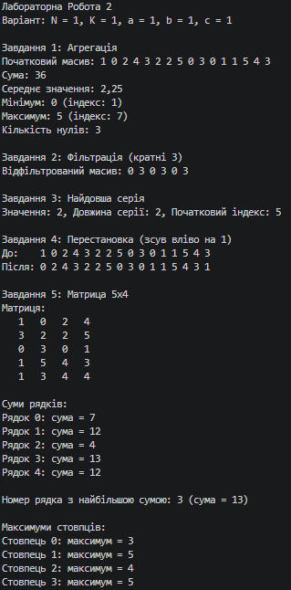
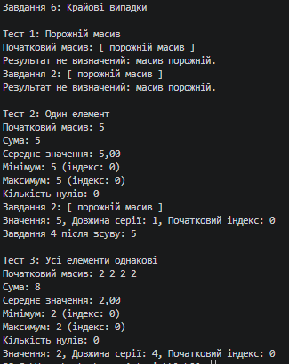

N = 1, K = 1, a = 1, b = 1, c = 1

## Опис методів
- `Task1_Aggregation`: Обчислює суму, середнє значення, мінімум, максимум (та їх індекси) і кількість нулів за один прохід.
- `Task2_FilterDivisibleBy3`: Виконує фільтрацію елементів, кратних 3, у новий масив точного розміру за два проходи.
- `Task3_LongestSeries`: Знаходить найдовшу серію однакових елементів підряд (з урахуванням останнього елемента).
- `Task4_ShiftLeftInPlace`: Зсуває елементи масиву циклічно вліво на 1 позицію без використання додаткових масивів.
- `Task5_MatrixProcessing`: Генерує матрицю 5x4, шукає суми рядків, максимуми стовпців та рядок з найбільшою сумою.

## Таблиця крайових випадків (Завдання 6)

| Вхід | Завдання | Очікувано | Отримано |
| :--- | :--- | :--- | :--- |
| **Порожній масив** (`[]`) | 1 | Повідомлення про некоректність | Результат не визначений |
| | 2 | Порожній масив (`[]`) | Порожній масив (`[]`) |
| | 3 | Повідомлення про некоректність | Результат не визначений |
| | 4 | Без змін (`[]`) | Без змін (`[]`) |
| **Один елемент** (`[5]`) | 1 | Sum=5, Avg=5.0, Min=5(0), Max=5(0), Zeros=0 | Sum=5, Avg=5.00, Min=5(0), Max=5(0), Zeros=0 |
| | 2 | Порожній масив (`[]`), бо 5 не кратна 3 | Порожній масив (`[]`) |
| | 3 | Значення: 5, Довжина: 1, Індекс: 0 | Значення: 5, Довжина: 1, Індекс: 0 |
| | 4 | Без змін (`[5]`) | Без змін (`[5]`) |
| **Усі елементи однакові** (`[2, 2, 2, 2]`) | 1 | Sum=8, Avg=2.0, Min=2(0), Max=2(0), Zeros=0 | Sum=8, Avg=2.00, Min=2(0), Max=2(0), Zeros=0 |
| | 3 | Значення: 2, Довжина: 4, Індекс: 0 | Значення: 2, Довжина: 4, Індекс: 0 |

## Вивід консолі
